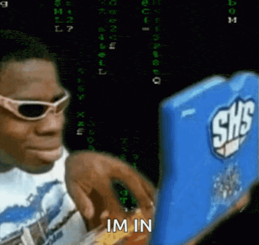

# Software engineering student

### Languages (ranked by confidence)
1)  Python

2)  JavaScript

3)  C

### Ongoing projects:
- Cobra (Web browser)
- Lønix (personal salary manager)
- LockedPocket (Password manager)
- StockGuru (Stock analyzing tool)
- WordFeud solver (by image recognition)
